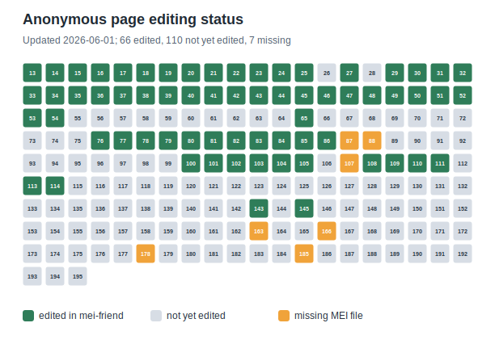

# DdT 1, Vol. 11: Dietrich Buxtehudes Instrumentalwerke

Work-in-progress MEI corpus for *Dietrich Buxtehudes Instrumentalwerke: Sonaten fuer Violine, Gambe und Cembalo*, edited by Carl Stiehl and published as volume 11 of *Denkmaeler deutscher Tonkunst*, first series.

The corpus is currently in the initial editing and cleanup phase. The directory structure and file organization are undergoing constant change while the encoding workflow is being refined.

The current MEI files are based on OMR data from the [musiconn.scoresearch](https://www.musiconn.de/services/musiconnscoresearch) project. At this stage, the OMR-derived data is represented as single pages. The intended final version should contain complete sonata-level MEI files with linked facsimile views.

All editorial work on this corpus is carried out in [mei-friend](https://mei-friend.mdw.ac.at/).

## Source

| Field               | Description                                                                                           |
| ------------------- | ----------------------------------------------------------------------------------------------------- |
| Composer            | Dietrich Buxtehude (GND:[118665685](https://d-nb.info/gnd/118665685))                                    |
| Title               | *Dietrich Buxtehudes Instrumentalwerke: Sonaten fuer Violine, Gambe und Cembalo. 11*                |
| Preferred title     | *Sonaten*                                                                                           |
| Editor              | Carl Stiehl (GND:[117245674](https://d-nb.info/gnd/117245674))                                           |
| Publication         | Leipzig: Breitkopf und Haertel, 1903                                                                  |
| Extent              | 1 score (VIII, 185 pages)                                                                             |
| Holding institution | Hochschule fuer Musik und Theater Muenchen, Bibliothek                                                |
| Shelfmark           | N2/X 1 DDT, 11                                                                                        |
| BSB-ID              | `991009385569707356`                                                                                |
| BV number           | `BV035347306`                                                                                       |
| WorldCat            | [`775063768`](https://search.worldcat.org/oclc/775063768)                                              |
| URN                 | [`urn:nbn:de:bvb:12-bsb00023199-0`](https://nbn-resolving.org/urn:nbn:de:bvb:12-bsb00023199-0)         |
| Digital facsimile   | [https://digitale-sammlungen.de/en/view/bsb00023199](https://digitale-sammlungen.de/en/view/bsb00023199) |

## Repository Layout

```text
.
├── .github/workflows/update-progress-grid.yml
├── docs/progress/page_grid.svg
├── README.md
├── scripts/update_readme_progress.py
└── 11_buxtehude_dietrich_buxtehudes_instrumentalwerke_bsb00023199/
    ├── bsb00023199_00013_facs_zones.mei
    ├── bsb00023199_00014_facs_zones.mei
    └── ...
```

The corpus directory currently contains page-level MEI files. Each file represents one page image from the BSB digitization and follows this naming pattern:

```text
bsb00023199_<page-image-number>_facs_zones.mei
```

For example, `bsb00023199_00013_facs_zones.mei` points to the corresponding IIIF image:

```text
https://api.digitale-sammlungen.de/iiif/image/v2/bsb00023199_00013/full/4134,/0/default.jpg
```

## Current Progress

The following anonymous grid is generated from the MEI files in this repository. It distinguishes pages that have mei-friend edit metadata, pages that are present but not yet edited, and page numbers that are currently missing from the image-number sequence.

<!-- progress-grid:start -->



Updated: 2026-04-30.unding

Work on this corpus is funded by the German Research Foundation (DFG), program Library and Information Services - E-Research Technologies (LIS), grant PF 669/18-1.

## Citation

When citing this corpus, include both the encoded repository and the underlying source:

> Dietrich Buxtehude. *Dietrich Buxtehudes Instrumentalwerke: Sonaten fuer Violine, Gambe und Cembalo*. Edited by Carl Stiehl. Leipzig: Breitkopf und Haertel, 1903. Digitized by Bayerische Staatsbibliothek, `bsb00023199`.

Digital facsimile: [https://digitale-sammlungen.de/en/view/bsb00023199](https://digitale-sammlungen.de/en/view/bsb00023199)

## License

The MEI data and repository materials are released under the [MIT License](LICENSE).

The historical source is in the public domain, but reuse of the BSB facsimile images and metadata may be subject to the terms of the providing institution. Please consult the BSB record linked above for current reuse information.
