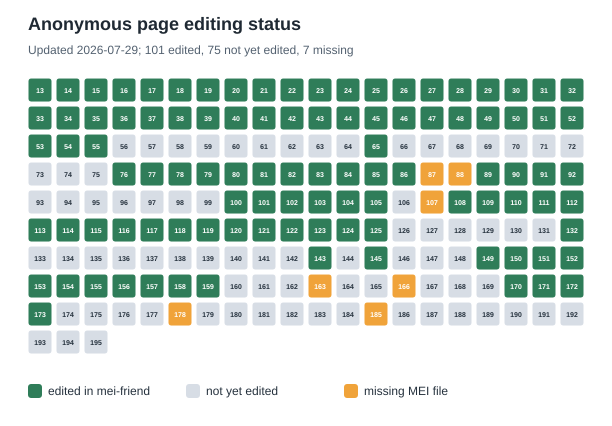

# DdT 1, Vol. 11: Dietrich Buxtehudes Instrumentalwerke

Work-in-progress MEI corpus for *Dietrich Buxtehudes Instrumentalwerke: Sonaten fuer Violine, Gambe und Cembalo*, edited by Carl Stiehl and published as volume 11 of *Denkmaeler deutscher Tonkunst*, first series.

The corpus is currently in the editing and cleanup phase. The repository keeps the page-level OMR data separate from the combined sonata-level MEI files, so that source-page cleanup and final work-level correction can be tracked independently.

The current MEI files are based on OMR data from the [musiconn.scoresearch](https://www.musiconn.de/services/musiconnscoresearch) project. The OMR-derived data is represented as single pages. The intended final version contains complete sonata-level MEI files with linked facsimile views.

All editorial work on this corpus is carried out in [mei-friend](https://mei-friend.mdw.ac.at/).

## Source

| Field               | Description                                                                                           |
| ------------------- | ----------------------------------------------------------------------------------------------------- |
| Composer            | Dietrich Buxtehude (GND:[118665685](https://d-nb.info/gnd/118665685))                                    |
| Title               | *Dietrich Buxtehudes Instrumentalwerke: Sonaten fuer Violine, Gambe und Cembalo. 11*                |
| Preferred title     | *Sonaten*                                                                                           |
| Editor              | Carl Stiehl (GND:[117245674](https://d-nb.info/gnd/117245674))                                           |
| Publication         | Leipzig: Breitkopf und Haertel, 1903                                                                  |
| Extent              | 1 score (VIII, 185 pages)                                                                             |
| Holding institution | Hochschule fuer Musik und Theater Muenchen, Bibliothek                                                |
| Shelfmark           | N2/X 1 DDT, 11                                                                                        |
| BSB-ID              | `991009385569707356`                                                                                |
| BV number           | `BV035347306`                                                                                       |
| WorldCat            | [`775063768`](https://search.worldcat.org/oclc/775063768)                                              |
| URN                 | [`urn:nbn:de:bvb:12-bsb00023199-0`](https://nbn-resolving.org/urn:nbn:de:bvb:12-bsb00023199-0)         |
| Digital facsimile   | [https://digitale-sammlungen.de/en/view/bsb00023199](https://digitale-sammlungen.de/en/view/bsb00023199) |

## Repository Layout

```text
.
├── .github/workflows/update-progress-grid.yml
├── docs/progress/page_grid.svg
├── README.md
├── scripts/update_readme_progress.py
├── 11_buxtehude_sonatas_final/
│   ├── buxtehude_op1_01_sonata_f_major_corr.mei
│   ├── buxtehude_op1_01_sonata_f_major_corr_consistency_report.csv
│   └── ...
└── 11_buxtehude_dietrich_buxtehudes_instrumentalwerke_bsb00023199/
    ├── bsb00023199_00013_facs_zones.mei
    ├── bsb00023199_00014_facs_zones.mei
    └── ...
```

The repository currently has two main MEI data directories:

- `11_buxtehude_dietrich_buxtehudes_instrumentalwerke_bsb00023199/` contains page-level OMR data derived from the BSB digitization. Progress in this directory is tracked anonymously by the generated page grid below.
- `11_buxtehude_sonatas_final/` contains combined sonata-level MEI files. These are tracked manually at work level because their editorial status depends on musical correction, metadata, and final validation rather than only page presence.

Files ending in `_consistency_report.csv` are temporary working files for inconsistency tracking during correction. They are not part of the final MEI edition and may be deleted after the corresponding sonata has been corrected and finalized.

The page-level OMR files follow this naming pattern:

```text
bsb00023199_<page-image-number>_facs_zones.mei
```

For example, `bsb00023199_00013_facs_zones.mei` points to the corresponding IIIF image:

```text
https://api.digitale-sammlungen.de/iiif/image/v2/bsb00023199_00013/full/4134,/0/default.jpg
```

Printed score pages and BSB image numbers are offset by ten. For example, printed page 3 corresponds to `bsb00023199_00013`; printed page 13 corresponds to `bsb00023199_00023`.

## Sonata-Level Files

The final sonata-level files use concise, sortable filenames:

```text
buxtehude_op<opus-number>_<work-number>_sonata_<key>.mei
```

Appendix works use:

```text
buxtehude_app_<work-number>_<short-title>_<key>.mei
```

Temporary working suffixes such as `_corr` may be used while a file is still being edited. Finalized files should use the clean names below.

Status values for the sonata-level files:

- `pending`: no sonata-level MEI file has been assembled yet.
- `combined`: page-level MEI files have been assembled into one work-level MEI file with linked facsimile surfaces.
- `corrected`: musical text and facsimile references have been corrected and local consistency checks have been reviewed.
- `finalized`: metadata/header, editorial review, validation, and repository naming are complete.

Work IDs use `Op. <opus>/<no.>` or `App. <no.>`. MEI files are `buxtehude_<stem>.mei` (see naming rules above).

| Work | Key | Pg. | BSB | MEI stem | Status |
| --- | --- | ---: | ---: | --- | --- |
| Op. I/1 | F | 3 | 00013 | op1_01_sonata_f_major | corrected |
| Op. I/2 | G | 13 | 00023 | op1_02_sonata_g_major | combined |
| Op. I/3 | A min. | 22 | 00032 | op1_03_sonata_a_minor | corrected |
| Op. I/4 | B♭ | 33 | 00043 | op1_04_sonata_b_flat_major | corrected |
| Op. I/5 | C | 44 | 00054 | op1_05_sonata_c_major | combined |
| Op. I/6 | D min. | 55 | 00065 | op1_06_sonata_d_minor | corrected |
| Op. I/7 | E min. | 66 | 00076 | op1_07_sonata_e_minor | corrected |
| Op. II/1 | B♭ | 79 | 00089 | op2_01_sonata_b_flat_major | pending |
| Op. II/2 | D | 90 | 00100 | op2_02_sonata_d_major | corrected |
| Op. II/3 | G min. | 103 | 00113 | op2_03_sonata_g_minor | combined |
| Op. II/4 | C min. | 116 | 00126 | op2_04_sonata_c_minor | pending |
| Op. II/5 | A | 126 | 00136 | op2_05_sonata_a_major | combined |
| Op. II/6 | E | 139 | 00149 | op2_06_sonata_e_major | corrected |
| Op. II/7 | F | 150 | 00160 | op2_07_sonata_f_major | pending |
| App. I | — | 160 | 00170 | app_01_suite_to_op1_04 | combined |
| App. II | C | 164 | 00174 | app_02_sonata_2violins_gamba_cembalo_c_major | pending |
| App. III | D | 176 | 00186 | app_03_sonata_gamba_violin_cembalo_d_major | pending |

## MEI Header Policy

Publication files use the official MEI 5.1 Common Music Notation customization, not the unrestricted `mei-all` schema. The two `xml-model` declarations and `meiversion="5.1+CMN"` identify that profile in each MEI file. The pinned local copy at `schemas/mei-CMN-5.1.rng` lets the full-check notebook validate the same profile reproducibly and without a network connection; it is validation infrastructure, not content required inside an MEI file.

The structure follows the [MEI metadata guidelines](https://music-encoding.org/guidelines/v5/content/metadata.html). It distinguishes the digital edition and its contributors (`fileDesc`) from the 1903 printed source (`sourceDesc`), records the transformation and editorial policy (`encodingDesc`), identifies the abstract work (`workList`), and lists meaningful revisions newest-first (`revisionDesc`). Only addressable agents and works need `xml:id`; the score's `mdiv/@decls` must point to the described work.

The MEI data and the BSB page images have different licenses and must be stated separately. Use one numbered `pb` for the first encoded content on every facsimile `surface`; use `sb` for all remaining system boundaries. `surface/@n` and `pb/@n` form a work-local sequence beginning with `1`. Record the original printed page range in `sourceDesc/biblScope`; `surface/@corresp` retains the exact IIIF canvas link.

Publication template (replace bracketed values per work):

```xml
<?xml-model href="https://music-encoding.org/schema/5.1/mei-CMN.rng" type="application/xml" schematypens="http://relaxng.org/ns/structure/1.0"?>
<?xml-model href="https://music-encoding.org/schema/5.1/mei-CMN.rng" type="application/xml" schematypens="http://purl.oclc.org/dsdl/schematron"?>
<mei xmlns="http://www.music-encoding.org/ns/mei" meiversion="5.1+CMN">
<meiHead xml:lang="en">
   <altId type="repository-stem">repository_stem</altId>
   <fileDesc>
      <titleStmt>
         <title>[work title]</title>
         <composer>
            <persName auth="GND" auth.uri="https://d-nb.info/gnd/118665685" codedval="118665685">Dietrich Buxtehude</persName>
         </composer>
         <respStmt xml:id="resp.camat">
            <resp>MEI encoding and sonata-level assembly</resp>
            <corpName>CAMAT</corpName>
         </respStmt>
         <respStmt xml:id="resp.editor">
            <resp>OMR correction and editorial review</resp>
            <persName>[editor name]</persName>
         </respStmt>
      </titleStmt>
      <editionStmt>
         <edition n="1.0.0">First digital edition</edition>
      </editionStmt>
      <pubStmt>
         <publisher>CAMAT Corpus Editions</publisher>
         <date isodate="YYYY-MM-DD">YYYY-MM-DD</date>
         <identifier type="URI">https://example.invalid/canonical-file-url</identifier>
         <availability>
            <useRestrict>MEI data released under the <ref target="https://spdx.org/licenses/MIT.html">MIT License</ref>.</useRestrict>
         </availability>
      </pubStmt>
      <sourceDesc>
         <source type="printed-edition">
            <bibl>
               <title>Dietrich Buxtehudes Instrumentalwerke: Sonaten für Violine, Gambe und Cembalo</title>
               <title type="series">Denkmäler deutscher Tonkunst, first series, vol. 11</title>
               <composer>Dietrich Buxtehude</composer>
               <editor>
                  <persName auth="GND" auth.uri="https://d-nb.info/gnd/117245674" codedval="117245674">Carl Stiehl</persName>
               </editor>
               <imprint>
                  <pubPlace>Leipzig</pubPlace>
                  <publisher>Breitkopf und Härtel</publisher>
                  <date isodate="1903">1903</date>
               </imprint>
               <identifier type="URN">urn:nbn:de:bvb:12-bsb00023199-0</identifier>
               <identifier type="BSB-ID">991009385569707356</identifier>
               <identifier type="BV">BV035347306</identifier>
               <identifier type="OCLC">775063768</identifier>
               <physLoc>
                  <repository>Hochschule für Musik und Theater München, Bibliothek</repository>
                  <identifier type="shelfmark">N2/X 1 DDT, 11</identifier>
               </physLoc>
               <ref type="digital-facsimile" target="https://digitale-sammlungen.de/en/view/bsb00023199">BSB digital facsimile</ref>
               <ref type="iiif-manifest" target="https://api.digitale-sammlungen.de/iiif/presentation/v2/bsb00023199/manifest">IIIF Presentation manifest</ref>
               <biblScope unit="page" from="FIRST" to="LAST">pp. FIRST-LAST</biblScope>
               <availability>
                  <useRestrict>Digital facsimile supplied by the Bayerische Staatsbibliothek under <ref target="https://creativecommons.org/licenses/by-nc-sa/4.0/">CC BY-NC-SA 4.0</ref>.</useRestrict>
               </availability>
            </bibl>
         </source>
      </sourceDesc>
   </fileDesc>
   <encodingDesc>
      <appInfo>
         <application>
            <name>musiconn.scoresearch</name>
            <p>Source OMR data.</p>
         </application>
         <application isodate="YYYY-MM-DDThh:mm:ss" version="VERSION">
            <name>Verovio</name>
            <p>Transcoded source data from MusicXML to MEI.</p>
         </application>
         <application startdate="YYYY-MM-DDThh:mm:ss" enddate="YYYY-MM-DDThh:mm:ss" version="VERSION">
            <name>mei-friend</name>
            <p>Manual correction and editorial review.</p>
         </application>
      </appInfo>
      <editorialDecl>
         <p>OMR and conversion errors were corrected against the source facsimile. The encoding is intended to reproduce the notation of the printed source; explicit editorial comments are recorded in annot elements with @type="editorial".</p>
         <p>Original page and system boundaries are represented by pb and sb elements. Surface and page-break numbers form a work-local sequence beginning with 1; the printed page range is recorded in sourceDesc. Each measure points to a measure zone on the corresponding facsimile surface using @facs.</p>
      </editorialDecl>
      <projectDesc>
         <p>This edition was prepared by CAMAT Corpus Editions as part of a DFG-funded corpus for music-analysis technologies (grant PF 669/18-1).</p>
      </projectDesc>
   </encodingDesc>
   <workList>
      <work xml:id="work.buxwvNNN">
         <identifier type="BuxWV">BuxWV NNN</identifier>
         <title>[work title]</title>
         <composer>
            <persName auth="GND" auth.uri="https://d-nb.info/gnd/118665685" codedval="118665685">Dietrich Buxtehude</persName>
         </composer>
         <key pname="c" mode="major">[key]</key>
         <perfMedium>
            <perfResList>
               <perfRes>Violin</perfRes>
               <perfRes>Viola da gamba</perfRes>
               <perfRes>Harpsichord</perfRes>
            </perfResList>
         </perfMedium>
      </work>
   </workList>
   <revisionDesc>
      <change isodate="YYYY-MM-DD" resp="#resp.camat #resp.editor">
         <changeDesc>
            <p>Applied the MEI 5.1 CMN publication profile, expanded source and work metadata, and normalized facsimile page boundaries.</p>
         </changeDesc>
      </change>
      <change isodate="YYYY-MM-DD" resp="#resp.editor">
         <changeDesc>
            <p>Completed musical correction and local validation.</p>
         </changeDesc>
      </change>
      <change isodate="YYYY-MM-DD" resp="#resp.camat">
         <changeDesc>
            <p>Combined page-level OMR files into sonata-level MEI.</p>
         </changeDesc>
      </change>
   </revisionDesc>
</meiHead>
<music>
   <facsimile>
      <surface xml:id="surface.PAGE_ID" n="1" corresp="https://example.invalid/iiif/canvas/NNN" ulx="0" uly="0" lrx="0" lry="0">
         <graphic xml:id="graphic.PAGE_ID" target="https://example.invalid/iiif/image/NNN" width="0" height="0" mimetype="image/jpeg" />
         <!-- measure zones -->
      </surface>
   </facsimile>
   <body>
      <mdiv xml:id="mdiv.work" decls="#work.buxwvNNN">
         <!-- score -->
      </mdiv>
   </body>
</music>
</mei>
```

## Current Progress

The following anonymous grid is automatically generated daily from the MEI files in this repository. It distinguishes pages that have mei-friend edit metadata, pages that are present but not yet edited, and page numbers that are currently missing from the image-number sequence.

<!-- progress-grid:start -->


Updated: 2026-08-15.

Current anonymous page status: 104 edited in mei-friend, 74 present but not yet edited, and 5 missing from the 183-page image sequence (178 MEI files currently present).
<!-- progress-grid:end -->

## Funding

Work on this corpus is funded by the German Research Foundation (DFG), program Library and Information Services - E-Research Technologies (LIS), grant PF 669/18-1.

## Citation

When citing this corpus, include both the encoded repository and the underlying source:

> Dietrich Buxtehude. *Dietrich Buxtehudes Instrumentalwerke: Sonaten für Violine, Gambe und Cembalo*. Edited by Carl Stiehl. Leipzig: Breitkopf und Härtel, 1903. Digitized by Bayerische Staatsbibliothek, `bsb00023199`.

Digital facsimile: [https://digitale-sammlungen.de/en/view/bsb00023199](https://digitale-sammlungen.de/en/view/bsb00023199)

## License

The MEI data and repository materials are released under the [MIT License](LICENSE).

The historical source is in the public domain, but reuse of the BSB facsimile images and metadata may be subject to the terms of the providing institution. Please consult the BSB record linked above for current reuse information.
